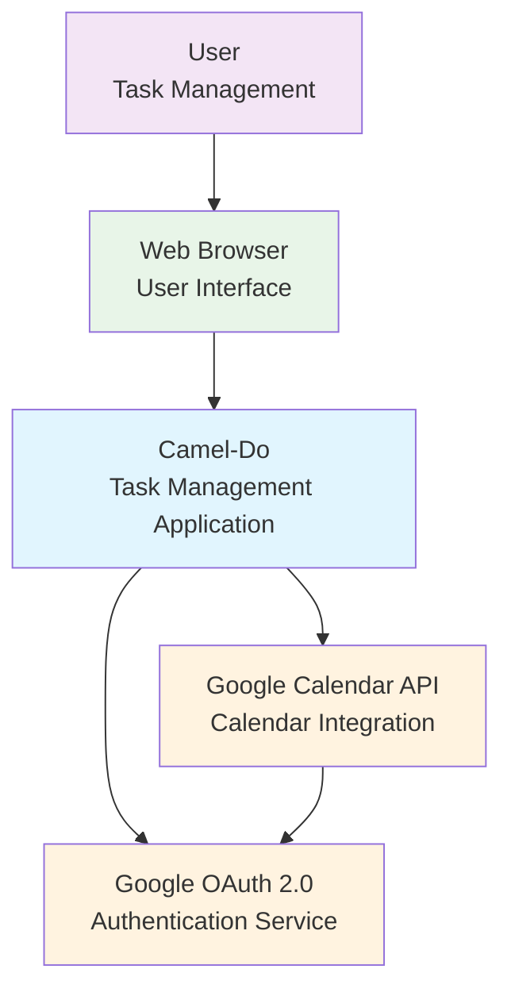

# System Context

## Overview

Camel-Do is a task management application that provides seamless integration with Google Calendar. It enables users to organize tasks into projects, schedule work with time tracking, and maintain bi-directional synchronization between their task list and calendar events.

## System Context Diagram

## Stakeholders

### Primary Users
- **Individual Knowledge Workers**: Professionals managing personal tasks and schedule
- **Project Contributors**: Team members coordinating work across projects
- **Calendar-Dependent Users**: People who rely heavily on calendar applications for time management

### System Integrators
- **Google Calendar Users**: Users with existing Google Calendar workflows
- **Multi-Device Users**: People accessing tasks across desktop and mobile browsers

## External Systems

### Google Calendar API
- **Purpose**: Bi-directional synchronization of tasks and calendar events
- **Integration Type**: RESTful API over HTTPS
- **Authentication**: OAuth 2.0 with Google
- **Data Flow**: 
  - Outbound: Task creation/updates → Calendar events
  - Inbound: Calendar event changes → Task updates
- **Dependencies**: Google API credentials, network connectivity

### Google OAuth 2.0 Service
- **Purpose**: User authentication and authorization for Google services
- **Integration Type**: OAuth 2.0 flow with redirect-based authentication
- **Data Flow**: 
  - Authentication tokens for Google Calendar API access
  - User profile information
- **Security**: HTTPS-only communication, token refresh handling

### Web Browser
- **Purpose**: User interface delivery and interaction
- **Integration Type**: HTTP/HTTPS with HTMX for dynamic updates
- **Supported Features**:
  - Modern JavaScript (ES6+) for Alpine.js
  - CSS Grid/Flexbox for responsive layouts
  - LocalStorage for client-side preferences
  - Drag & Drop APIs for task management

## System Boundaries

### Inside System Boundary
- Task and project management logic
- Google Calendar synchronization
- User authentication flows
- Template rendering and HTML generation
- Local data persistence
- Real-time UI updates via HTMX

### Outside System Boundary
- Google Calendar data storage
- User authentication credentials (managed by Google)
- Web browser rendering engine
- Network infrastructure
- Google API rate limiting and availability

## Key Capabilities

### Core Features
1. **Task Management**: Create, update, delete, and organize tasks
2. **Project Organization**: Group tasks into customizable projects with colors/icons
3. **Time Scheduling**: Set start times and durations for tasks
4. **Calendar Sync**: Bi-directional synchronization with Google Calendar
5. **Real-time Updates**: Dynamic UI updates without page refreshes

### Quality Attributes
- **Usability**: Drag & drop interface, responsive design
- **Reliability**: Offline-capable with local data persistence
- **Performance**: Server-side rendering, minimal JavaScript
- **Security**: OAuth 2.0 authentication, HTTPS communication
- **Maintainability**: Type-safe templates, clean architecture

## System Constraints

### Technical Constraints
- **Language**: Go 1.24+ for backend implementation
- **Database**: BoltDB for local data persistence (single-user)
- **Authentication**: Dependent on Google OAuth 2.0 availability
- **Browser Support**: Modern browsers with JavaScript enabled

### Business Constraints
- **Google API Limits**: Subject to Google Calendar API quotas and rate limits
- **Single-User Application**: Designed for individual use, not team collaboration
- **Network Dependency**: Requires internet connectivity for calendar synchronization

### Operational Constraints
- **Deployment**: Single binary deployment with embedded assets
- **Configuration**: Minimal configuration via environment variables
- **Monitoring**: Basic application logging, no external monitoring dependencies