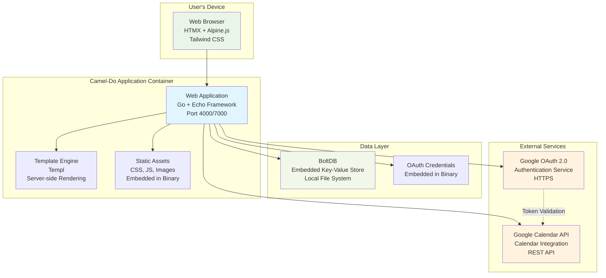
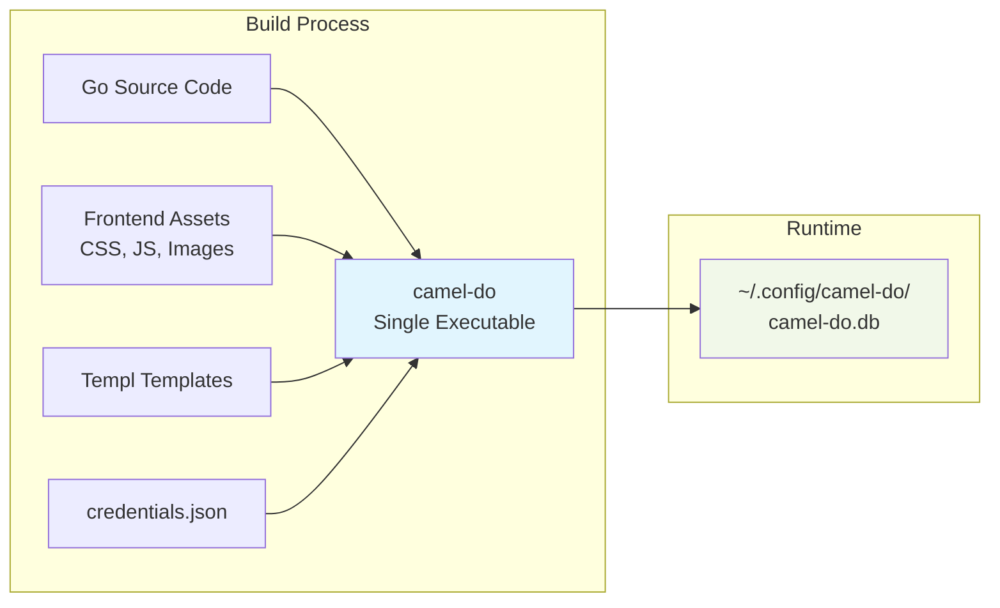

# Container Architecture

## Overview

Camel-Do follows a layered container architecture with clear separation between the web application, data persistence, and external service integrations. The application is designed as a self-contained single binary with embedded assets and dependencies.

## Container Diagram



## Containers

### Web Application Container
- **Technology**: Go 1.24+ with Echo web framework
- **Port**: 4000 (development) / 7000 (production)  
- **Responsibilities**:
  - HTTP request/response handling
  - Business logic orchestration via services
  - OAuth authentication flows
  - Google Calendar API integration
  - Template rendering coordination
- **Deployment**: Single Go binary with embedded assets
- **Scaling**: Single instance (designed for personal use)

### Template Engine Container  
- **Technology**: Templ for type-safe HTML generation
- **Integration**: Embedded within web application process
- **Responsibilities**:
  - Server-side HTML rendering
  - Component-based template organization
  - Type-safe template compilation
  - HTMX attribute management
- **Build Process**: Templates compiled to Go code at build time

### Static Assets Container
- **Technology**: Embedded filesystem in Go binary
- **Content Types**: CSS, JavaScript, images, icons, manifests
- **Build Process**: 
  - Frontend assets built with Bun
  - Assets embedded via `go:embed` directives
  - Served directly by Echo static middleware
- **Caching**: Browser caching with cache-busting for updates

### Data Persistence Container (BoltDB)
- **Technology**: BoltDB embedded key-value database
- **Storage Location**: User's configuration directory (`~/config/camel-do/`)
- **Data Format**: Binary serialization using Go's `encoding/gob`
- **Responsibilities**:
  - Task and project data persistence
  - User preferences and settings
  - OAuth token storage
  - Local caching of Google Calendar data
- **Backup**: File-based, user managed

### OAuth Credentials Container
- **Technology**: Embedded JSON configuration in binary
- **Security**: Client credentials embedded (public information)
- **Responsibilities**:
  - Google OAuth 2.0 client configuration
  - API endpoint definitions
  - Scope definitions for Google Calendar access

## Inter-Container Communication

### HTTP Communication
- **Browser ↔ Web Application**: HTTPS with HTMX for partial updates
- **Web Application ↔ Google Services**: HTTPS REST API calls with OAuth 2.0

### Internal Communication
- **Web Application ↔ Template Engine**: Direct Go function calls
- **Web Application ↔ BoltDB**: Local file I/O through BoltDB driver
- **Web Application ↔ Static Assets**: Embedded filesystem access

## Deployment Architecture

### Single Binary Deployment


### Development vs Production

| Aspect | Development | Production |
|--------|-------------|-------------|
| **Port** | 4000 | 7000 (Docker) |
| **Live Reload** | Air + Templ watch | Disabled |
| **Assets** | Built on change | Pre-built and embedded |
| **Database** | Local development DB | User config directory |
| **Logging** | Debug level | Info level |
| **Build Tools** | Air, Bun, Templ | Docker multi-stage |

## Service Dependencies

### Required External Services
- **Google OAuth 2.0**: Authentication and authorization
- **Google Calendar API**: Task synchronization
- **Network Connectivity**: Required for calendar sync

### Optional Dependencies  
- **Docker**: For containerized deployment
- **Reverse Proxy**: For HTTPS termination (nginx, Traefik)

## Container Configuration

### Environment Variables
```bash
PORT=4000                    # HTTP server port
BACKEND_PORT=7000           # Alternative port for Docker
LOG_LEVEL=debug             # Logging level (debug, info, warn, error)
```

### Volume Mounts (Docker)
```yaml
volumes:
  - ~/.config/camel-do:/root/.config/camel-do  # Database persistence
```

### Health Checks
- **HTTP Health Check**: `GET /` returns 200 OK
- **Database Check**: BoltDB file accessibility
- **Template Check**: Template compilation status

## Security Boundaries

### Network Security
- **External**: HTTPS-only communication with Google services
- **Internal**: Local communication within single process
- **Browser**: HTTPS enforced for OAuth flows

### Data Security  
- **At Rest**: BoltDB file permissions (600)
- **In Transit**: HTTPS for all external communication
- **Credentials**: OAuth tokens encrypted in database

### Process Security
- **Single User**: Application designed for single-user operation
- **File System**: Limited to user's configuration directory
- **Network**: Outbound HTTPS only to Google services