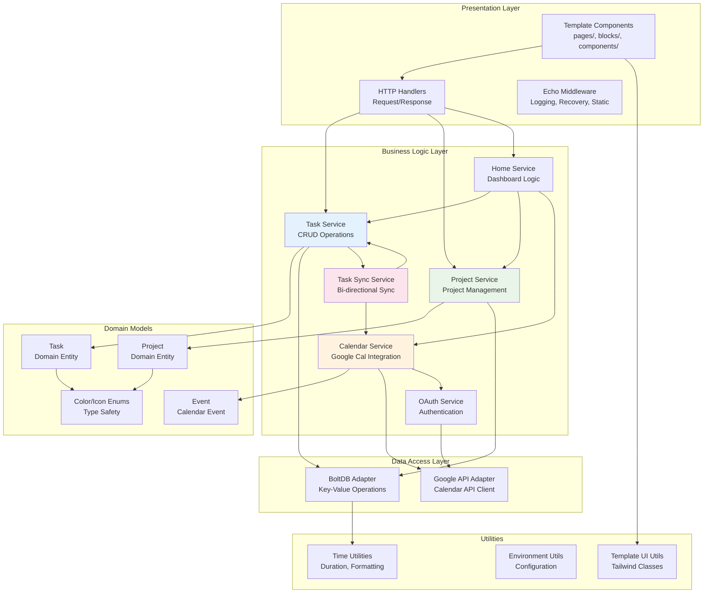
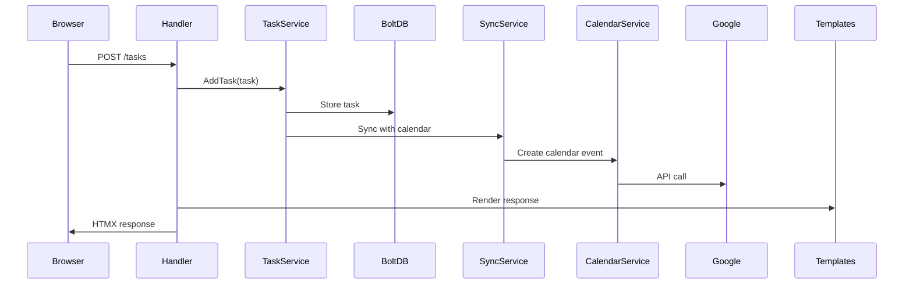
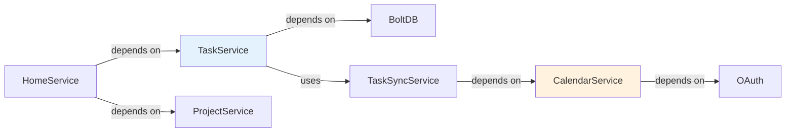

# Component Architecture

## Overview

Camel-Do follows a layered component architecture with clear separation of concerns across presentation, business logic, and data access layers. The architecture emphasizes type safety, testability, and maintainability through Go's strong type system and interface-based design.

## Component Architecture Diagram



## Layer Descriptions

### Presentation Layer

#### Template Components (`/templates/`)
- **Pages** (`pages/`): Full page templates (main.templ, dialogs)
- **Blocks** (`blocks/`): UI sections (backlog, tasklist, timeline, titlebar)  
- **Components** (`components/`): Reusable UI elements (buttons, dialogs, pickers)

**Responsibilities**:
- Server-side HTML generation with type safety
- HTMX attribute management for dynamic updates
- Alpine.js integration for client-side interactivity
- Responsive design with Tailwind CSS

#### HTTP Handlers
- **Task Handlers** (`services/task/taskhandlers.go`): Task CRUD operations
- **Project Handlers** (`services/project/projecthandlers.go`): Project management
- **Home Handler** (`services/home/homehandler.go`): Dashboard rendering
- **Component Service** (`services/home/componentsservice.go`): Reusable UI components

**Responsibilities**:
- HTTP request parsing and validation
- Response formatting and error handling
- Service orchestration and coordination
- Template rendering with context

#### Middleware
- **Request Logging**: Structured logging with slog
- **Recovery**: Panic recovery with HTMX-compatible error responses
- **Static Files**: Embedded asset serving

### Business Logic Layer

#### Task Service (`services/task/taskservice.go`)
**Responsibilities**:
- Task CRUD operations (Create, Read, Update, Delete)
- Task validation and business rules
- Task querying and filtering (today's tasks, project tasks)
- Integration with Task Sync Service

**Key Methods**:
```go
AddTask(task *model.Task) error
GetTask(id string) (*model.Task, error) 
UpdateTask(task *model.Task) error
DeleteTask(id string) error
GetTodaysTasks() (*model.TaskList, error)
```

#### Project Service (`services/project/projectservice.go`)
**Responsibilities**:
- Project CRUD operations
- Project validation and color/icon management
- Project indexing and lookup

**Key Methods**:
```go
AddProject(project model.Project) error
GetProject(id string) (*model.Project, error)
GetProjects() (*model.ProjectIndex, error)
```

#### Calendar Service (`services/cal/calendarservice.go`)
**Responsibilities**:
- Google Calendar API integration
- Event retrieval and creation
- Calendar-specific business logic

#### Task Sync Service (`services/task/tasksyncservice.go`)
**Responsibilities**:
- Bi-directional synchronization between tasks and calendar events
- Conflict resolution and data consistency
- Sync scheduling and coordination

#### OAuth Service (`services/oauth/oauth.go`)
**Responsibilities**:
- Google OAuth 2.0 authentication flow
- Token management and refresh
- User authorization and credentials

### Domain Models Layer

#### Core Entities
- **Task** (`model/task.go`): Primary domain entity with timeline positioning
- **Project** (`model/project.go`): Task organization and categorization
- **Event** (`model/event.go`): Calendar event representation

#### Type Safety Features
- **Color Enum** (`model/color.go`, `model/color_enum.go`): Type-safe color definitions
- **Icon Enum** (`model/icon.go`, `model/icon_enum.go`): Type-safe icon definitions
- **Duration** (`model/duration.go`): Time duration with validation

**Key Features**:
- JSON and GOB serialization support
- Iterator patterns for collection traversal
- Immutable value objects where appropriate
- Business logic encapsulation (timeline positioning)

### Data Access Layer

#### BoltDB Adapter
**Responsibilities**:
- Key-value database operations
- Binary serialization using `encoding/gob`
- Transaction management
- Data consistency and integrity

**Storage Patterns**:
```go
// Bucket organization
tasks/     -> Task entities
projects/  -> Project entities  
settings/  -> Application settings
oauth/     -> OAuth tokens
```

#### Google API Adapter
**Responsibilities**:
- Google Calendar API client management
- HTTP request/response handling
- OAuth token integration
- Rate limiting and error handling

### Utilities Layer

#### Time Utilities (`utils/time.go`)
**Responsibilities**:
- Time formatting and parsing
- Duration calculations
- Timezone handling

#### Environment Utilities (`utils/env.go`) 
**Responsibilities**:
- Environment variable management
- Configuration defaults
- Type conversion utilities

#### Template UI Utilities (`utils/templui.go`)
**Responsibilities**:
- Tailwind CSS class generation
- Dynamic styling based on state
- CSS utility functions

## Component Interactions

### Request Flow Example: Creating a Task



### Service Dependencies



## Design Patterns

### Dependency Injection
- Services receive dependencies via constructors
- Interfaces used for better testability
- Main function wires dependencies

### Repository Pattern (Implicit)
- Services encapsulate data access logic
- BoltDB operations isolated within services
- Domain models separate from persistence concerns

### Template Method Pattern
- Common handler patterns for CRUD operations
- Consistent error handling across handlers
- Standardized response formats

## Error Handling Strategy

### HTTP Error Handling
- Custom HTMX-compatible error handler
- Error messages rendered as template components
- Graceful degradation for failed operations

### Service Error Handling  
- Explicit error returns following Go conventions
- Error wrapping for context preservation
- Logging at appropriate levels (debug, info, error)

## Testing Architecture

### Unit Testing
- Service layer unit tests with mock dependencies
- Domain model tests for business logic
- Utility function tests for edge cases

### Integration Testing
- Handler tests with test database
- Template rendering tests
- OAuth flow integration tests

### Test Organization
```
service_test.go     -> Service unit tests
handler_test.go     -> HTTP handler tests  
model_test.go       -> Domain model tests
*_integration_test.go -> Integration tests
```