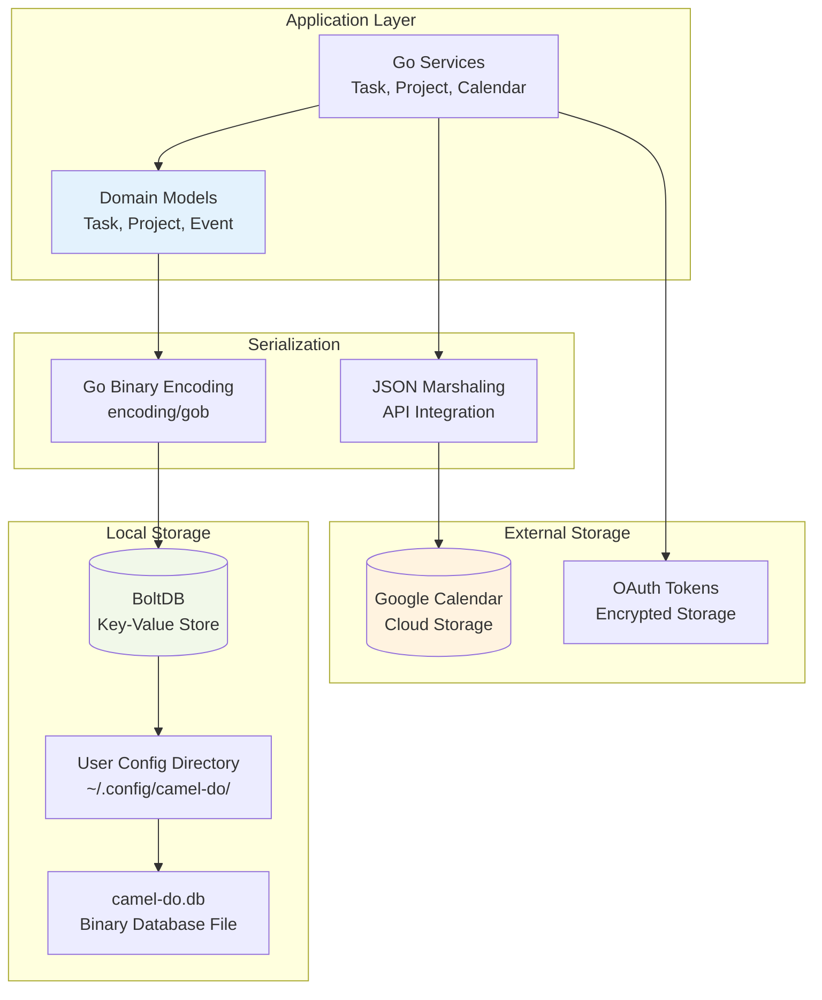
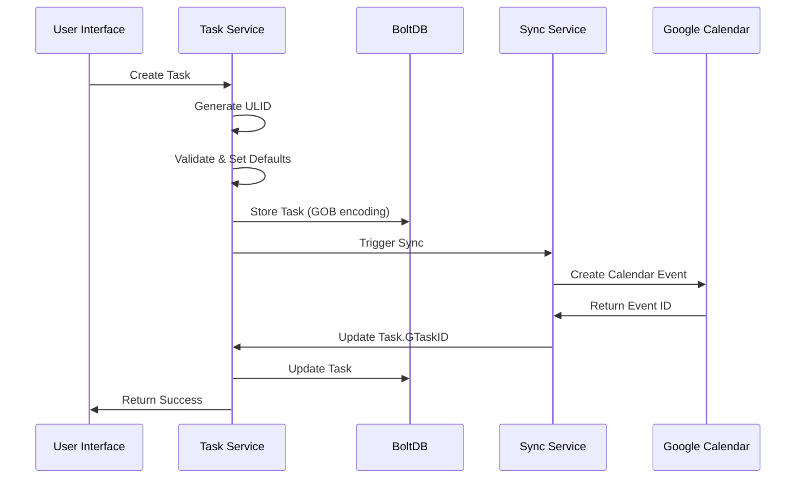
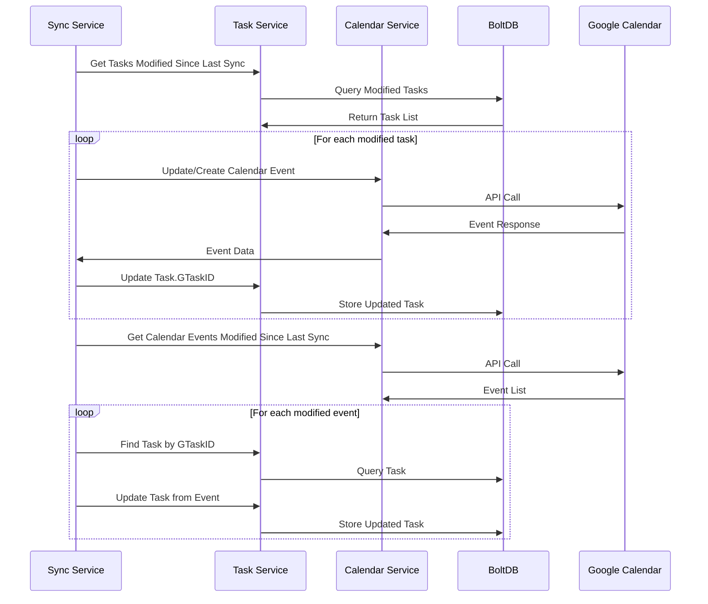

# Data Architecture

## Overview

Camel-Do uses a simple yet effective data architecture centered around BoltDB for local persistence with bi-directional synchronization to Google Calendar. The design emphasizes data consistency, type safety, and minimal external dependencies while supporting offline-first operation.

## Data Architecture Diagram



## Data Storage Layers

### Local Storage (BoltDB)

#### Database Structure
```
camel-do.db (BoltDB file)
├── tasks/          -> Task entities bucket
├── projects/       -> Project entities bucket  
├── oauth/          -> OAuth tokens bucket
└── settings/       -> Application settings bucket
```

#### Storage Location
- **Development**: Local project directory
- **Production**: User configuration directory (`~/.config/camel-do/`)
- **Permissions**: 0600 (user read/write only)
- **Backup**: User-managed file-based backup

#### Key-Value Organization
```go
// Tasks bucket: task_id -> serialized Task
"01HF6T8..." -> Task{ID: "01HF6T8...", Title: "Review PR", ...}

// Projects bucket: project_id -> serialized Project  
"01HF6T9..." -> Project{ID: "01HF6T9...", Name: "Web App", ...}

// OAuth bucket: service_name -> encrypted tokens
"google" -> {"access_token": "ya29...", "refresh_token": "1//0..."}
```

### External Storage (Google Calendar)

#### Data Synchronization
- **Bi-directional**: Tasks ↔ Calendar Events
- **Conflict Resolution**: Last-modified-wins strategy
- **Sync Triggers**: Task creation/update, periodic sync
- **Data Mapping**: Task properties mapped to Calendar Event fields

#### Google Calendar Event Mapping
```go
Task                    -> Calendar Event
├── Title              -> Summary  
├── Description        -> Description
├── StartTime          -> Start (DateTime)
├── Duration           -> End (calculated from Start + Duration)
├── ProjectID          -> ColorId (project color mapping)
└── ID                 -> ExtendedProperties.private.camel_do_task_id
```

## Domain Models

### Task Entity
```go
type Task struct {
    ID          string           // ULID identifier
    CreatedAt   time.Time        // Creation timestamp
    UpdatedAt   time.Time        // Last modification
    
    Title       zero.String      // Task title
    Description zero.String      // Task description  
    StartTime   zero.Time        // Scheduled start time
    Duration    zero.Int32       // Duration in minutes
    Completed   zero.Bool        // Completion status
    Hidden      zero.Bool        // Visibility flag
    Rank        zero.Int32       // Sort order
    ProjectID   zero.String      // Foreign key to Project
    GTaskID     zero.String      // Google Calendar Event ID
    Position    TimelinePosition // UI positioning data
}
```

### Project Entity
```go
type Project struct {
    ID        string           // ULID identifier
    CreatedAt time.Time        // Creation timestamp
    UpdatedAt time.Time        // Last modification
    
    Name      string           // Project name
    Color     Color            // Color enum for UI
    Icon      Icon             // Icon enum for UI
}
```

### Value Objects

#### TimelinePosition
```go
type TimelinePosition struct {
    Slot int  // Grid position (15-minute slots, 6 AM - 6 PM)
    Size int  // Number of slots (duration / 15 minutes)
}
```

#### Enums (Type-Safe)
```go
//go:generate go-enum -type Color
type Color string
const (
    ColorZinc   Color = "zinc"    // Default
    ColorRed    Color = "red"     // High priority
    ColorBlue   Color = "blue"    // Work projects
    ColorGreen  Color = "green"   // Personal projects
    // ... additional colors
)

//go:generate go-enum -type Icon  
type Icon string
const (
    IconUnknown Icon = "unknown"  // Default
    IconCode    Icon = "code"     // Development tasks
    IconMeeting Icon = "meeting"  // Meetings
    // ... additional icons
)
```

## Data Flow Patterns

### Task Creation Flow


### Task Synchronization Flow


## Data Consistency Strategies

### Local Consistency
- **ACID Properties**: BoltDB provides ACID transactions
- **Atomic Updates**: Task and sync operations use transactions
- **Referential Integrity**: ProjectID validated before task creation
- **Data Validation**: Model validation before persistence

### Eventual Consistency (Calendar Sync)
- **Conflict Resolution**: Last-modified-wins with user notification
- **Sync Intervals**: Configurable periodic sync (default: on-demand)
- **Error Handling**: Failed syncs queued for retry
- **Offline Support**: Local operations continue without network

### Data Integrity Checks
```go
// Task validation before persistence
func (t *Task) Validate() error {
    if t.Title.String == "" {
        return errors.New("title required")
    }
    if t.Duration.Int32 < 0 {
        return errors.New("duration must be positive") 
    }
    if t.StartTime.Valid && t.Duration.Valid {
        // Validate timeline positioning
    }
    return nil
}
```

## Serialization Formats

### Internal Serialization (GOB)
- **Format**: Go Binary Encoding (`encoding/gob`)
- **Advantages**: Type-safe, efficient, handles complex structures
- **Usage**: BoltDB storage, internal data transfer
- **Performance**: Fast serialization/deserialization

### External Serialization (JSON)
- **Format**: JSON with custom marshaling
- **Advantages**: Human-readable, API compatibility
- **Usage**: Google Calendar API, debugging, exports
- **Custom Marshaling**: Handles zero values and time formatting

```go
func (t Task) MarshalJSON() ([]byte, error) {
    return json.Marshal(map[string]any{
        "id":          t.ID,
        "title":       t.Title.String,
        "description": t.Description.String,
        "startTime":   t.StartTime.Time,
        "duration":    t.Duration,
        "completed":   t.Completed.Bool,
        "projectId":   t.ProjectID.String,
        "position":    t.Position,
    })
}
```

## Data Migration Strategy

### Schema Evolution
- **Version Tracking**: Database version stored in settings bucket
- **Backward Compatibility**: New fields added as optional with defaults
- **Migration Scripts**: Go functions for data transformation
- **Rollback Support**: Backup before migration, restore capability

### Migration Example
```go
func migrateV1toV2(db *bolt.DB) error {
    return db.Update(func(tx *bolt.Tx) error {
        bucket := tx.Bucket([]byte("tasks"))
        if bucket == nil {
            return nil
        }
        
        return bucket.ForEach(func(k, v []byte) error {
            var task Task
            if err := task.Unmarshal(v); err != nil {
                return err
            }
            
            // Add new field with default
            if task.Position.Slot == 0 {
                task.Position = NewTimelinePosition(
                    task.StartTime.Time, 
                    task.Duration.Int32,
                )
            }
            
            newBytes, err := task.Marshal()
            if err != nil {
                return err
            }
            
            return bucket.Put(k, newBytes)
        })
    })
}
```

## Performance Considerations

### BoltDB Optimization
- **Batch Operations**: Group multiple writes in single transaction
- **Index Strategy**: Use composite keys for range queries
- **Memory Usage**: Lazy loading of large collections
- **File Size**: Periodic compaction for optimal size

### Caching Strategy
- **In-Memory Cache**: Frequently accessed projects cached
- **Cache Invalidation**: Time-based and event-driven invalidation
- **Sync Optimization**: Track last sync timestamps to minimize API calls

### Query Patterns
```go
// Efficient today's tasks query
func (ts *TaskService) GetTodaysTasks() (*TaskList, error) {
    today := time.Now().Truncate(24 * time.Hour)
    tomorrow := today.Add(24 * time.Hour)
    
    // Use time-based filtering to avoid loading all tasks
    return ts.getTasksInRange(today, tomorrow)
}
```

## Backup and Recovery

### Backup Strategy
- **File-Based**: Copy BoltDB file for complete backup
- **Export Format**: JSON export for human-readable backups
- **Automated**: User-configurable backup scheduling
- **Versioning**: Multiple backup versions with rotation

### Recovery Procedures
- **Database Corruption**: Restore from file backup
- **Sync Issues**: Re-sync from Google Calendar
- **Data Loss**: Import from JSON backup
- **Partial Recovery**: Selective restoration by entity type