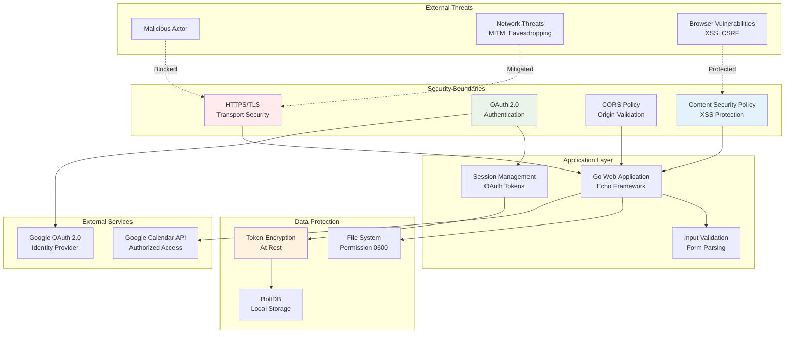

# Security Architecture

## Overview

Camel-Do implements a defense-in-depth security strategy focusing on OAuth 2.0 authentication, secure data storage, and protection against common web application vulnerabilities. The application is designed for single-user operation with secure integration to Google services.

## Security Architecture Diagram



## Security Domains

### Authentication & Authorization

#### OAuth 2.0 Implementation
- **Provider**: Google OAuth 2.0 with PKCE (Proof Key for Code Exchange)
- **Flow**: Authorization Code flow with state parameter
- **Scopes**: Minimal required scopes for Calendar API access
- **Token Storage**: Encrypted storage in local BoltDB

```go
// OAuth configuration
oauth2.Config{
    ClientID:     credentials.ClientID,
    ClientSecret: credentials.ClientSecret,
    Endpoint:     google.Endpoint,
    RedirectURL:  "http://localhost:4000/auth/callback",
    Scopes:       []string{calendar.CalendarScope},
}
```

#### Session Management
- **Token Lifecycle**: Access tokens with refresh capability
- **Expiration Handling**: Automatic token refresh before expiration
- **Revocation**: Support for token revocation on logout
- **State Management**: Secure state parameter for CSRF protection

#### Authorization Levels
```
Unauthenticated -> Read-only access to login page
Authenticated   -> Full access to personal tasks and projects
Google Calendar -> Delegated access via OAuth tokens
```

### Transport Security

#### HTTPS Enforcement
- **Development**: HTTP allowed for localhost (OAuth requirement)
- **Production**: HTTPS enforced for all external communication
- **Certificate Management**: Let's Encrypt or custom certificates
- **HSTS**: HTTP Strict Transport Security headers

#### API Security
- **Google APIs**: HTTPS-only communication with certificate pinning
- **Request Signing**: OAuth 2.0 Bearer token authentication
- **Rate Limiting**: Respect Google API rate limits and quotas

### Input Validation & Sanitization

#### Form Validation
```go
type Task struct {
    Title       zero.String `form:"title" validate:"required,max=200"`
    Description zero.String `form:"description" validate:"max=1000"`
    Duration    zero.Int32  `form:"duration" validate:"min=0,max=1440"`
    StartTime   zero.Time   `form:"startTime" validate:"datetime"`
}
```

#### HTML Output Encoding
- **Template Safety**: Templ provides automatic HTML escaping
- **XSS Prevention**: All user input escaped in templates
- **Content Type**: Proper Content-Type headers set

#### SQL Injection Prevention
- **No SQL**: BoltDB key-value store eliminates SQL injection risk
- **Binary Serialization**: GOB encoding prevents injection attacks

### Data Protection

#### Encryption at Rest
- **OAuth Tokens**: Encrypted using Go's `crypto` package
- **Database File**: OS-level file permissions (0600)
- **Sensitive Data**: No plaintext storage of credentials

#### Encryption Implementation
```go
// Token encryption before storage
func encryptToken(token *oauth2.Token, key []byte) ([]byte, error) {
    block, err := aes.NewCipher(key)
    if err != nil {
        return nil, err
    }
    
    gcm, err := cipher.NewGCM(block)
    if err != nil {
        return nil, err
    }
    
    nonce := make([]byte, gcm.NonceSize())
    if _, err = io.ReadFull(rand.Reader, nonce); err != nil {
        return nil, err
    }
    
    tokenBytes, _ := json.Marshal(token)
    ciphertext := gcm.Seal(nonce, nonce, tokenBytes, nil)
    return ciphertext, nil
}
```

#### File System Security
- **Database Location**: User's protected configuration directory
- **File Permissions**: 0600 (owner read/write only)
- **Directory Permissions**: 0700 (owner access only)
- **Backup Security**: Encrypted backups recommended

### Web Application Security

#### Cross-Site Scripting (XSS) Prevention
- **Template Escaping**: Automatic HTML escaping in Templ templates
- **Content Security Policy**: Strict CSP headers
- **Input Sanitization**: All user inputs validated and escaped

```http
Content-Security-Policy: default-src 'self'; 
                        script-src 'self' 'unsafe-inline';
                        style-src 'self' 'unsafe-inline';
                        img-src 'self' data:;
                        connect-src 'self';
```

#### Cross-Site Request Forgery (CSRF) Protection
- **OAuth State**: Cryptographically secure state parameter
- **SameSite Cookies**: SameSite=Strict for session cookies
- **Origin Validation**: Request origin validation for sensitive operations

#### Content Security
- **MIME Type Sniffing**: X-Content-Type-Options: nosniff
- **Frame Options**: X-Frame-Options: DENY
- **XSS Protection**: X-XSS-Protection: 1; mode=block

### Error Handling & Information Disclosure

#### Secure Error Handling
```go
func customHTTPErrorHandler(err error, c echo.Context) {
    if c.Response().Committed {
        return
    }
    
    code := http.StatusInternalServerError
    if he, ok := err.(*echo.HTTPError); ok {
        code = he.Code
    }
    
    // Log full error details internally
    slog.Error("HTTP Error", "error", err, "path", c.Request().URL.Path)
    
    // Return sanitized error to user
    messageTemplate := components.ErrorMessage("An error occurred")
    htmx.NewResponse().StatusCode(code).RenderTempl(c.Request().Context(), 
        c.Response().Writer, messageTemplate)
}
```

#### Logging Security
- **Sensitive Data**: No logging of OAuth tokens or personal data
- **Error Context**: Sufficient context for debugging without exposure
- **Log Rotation**: Implement log rotation to manage disk usage
- **Access Control**: Log files protected with appropriate permissions

## Threat Model

### STRIDE Analysis

#### Spoofing
**Threats**:
- Impersonation of legitimate user
- Fake Google OAuth responses

**Mitigations**:
- OAuth 2.0 with state parameter validation
- HTTPS certificate validation
- Secure redirect URI validation

#### Tampering
**Threats**:
- Modification of task data in transit
- Database file tampering
- OAuth token manipulation

**Mitigations**:
- HTTPS for all external communication
- File system permissions (0600)
- Token encryption at rest
- Integrity checks on critical operations

#### Repudiation
**Threats**:
- Denial of actions performed
- Lack of audit trail

**Mitigations**:
- Application logging with timestamps
- OAuth token usage tracking
- Data modification timestamps

#### Information Disclosure
**Threats**:
- Exposure of personal task data
- OAuth token leakage
- Google Calendar access

**Mitigations**:
- Local-only data storage
- Encrypted token storage
- Minimal scope OAuth requests
- Secure error messages

#### Denial of Service
**Threats**:
- Resource exhaustion attacks
- Google API quota exhaustion
- Database corruption

**Mitigations**:
- Rate limiting on API calls
- Input validation and size limits
- Database transaction management
- Graceful error handling

#### Elevation of Privilege
**Threats**:
- Unauthorized access to Google Calendar
- File system access beyond application scope
- Code injection attacks

**Mitigations**:
- Minimal OAuth scopes
- Process isolation
- Input validation and sanitization
- Principle of least privilege

### Attack Vectors

#### Network-Based Attacks
**Man-in-the-Middle (MITM)**:
- **Risk**: Interception of OAuth tokens
- **Mitigation**: HTTPS enforcement, certificate pinning

**DNS Poisoning**:
- **Risk**: Redirect to malicious OAuth provider
- **Mitigation**: Hardcoded Google endpoint URLs

#### Local Attacks
**Database Access**:
- **Risk**: Direct file system access to BoltDB
- **Mitigation**: File permissions, encryption at rest

**Process Memory**:
- **Risk**: Memory dumps revealing tokens
- **Mitigation**: Secure memory handling, token lifecycle management

#### Web Application Attacks
**Cross-Site Scripting (XSS)**:
- **Risk**: Malicious script execution
- **Mitigation**: Template escaping, CSP headers

**OAuth Attacks**:
- **Risk**: Authorization code interception
- **Mitigation**: State parameter, PKCE implementation

## Security Monitoring

### Logging Strategy
```go
// Security event logging
func logSecurityEvent(event string, details map[string]interface{}) {
    slog.Info("SECURITY_EVENT",
        slog.String("event", event),
        slog.String("timestamp", time.Now().UTC().Format(time.RFC3339)),
        slog.Any("details", details),
    )
}

// Examples
logSecurityEvent("oauth_success", map[string]interface{}{
    "provider": "google",
    "scopes":   []string{calendar.CalendarScope},
})

logSecurityEvent("invalid_token", map[string]interface{}{
    "endpoint": "/api/tasks",
    "ip":      clientIP,
})
```

### Security Metrics
- **Authentication Events**: Success/failure rates
- **API Usage**: Google Calendar API call patterns
- **Error Rates**: Security-related error frequency
- **Token Refresh**: Token lifecycle metrics

## Compliance Considerations

### Privacy Protection
- **Data Minimization**: Only collect necessary task/calendar data
- **Local Storage**: No cloud storage of personal data
- **User Control**: Full control over data export/deletion

### OAuth 2.0 Best Practices
- **PKCE**: Proof Key for Code Exchange implementation
- **State Parameter**: Cryptographically secure state validation
- **Minimal Scopes**: Request only necessary permissions
- **Token Rotation**: Regular token refresh

### Security Updates
- **Dependency Management**: Regular updates of Go modules
- **Vulnerability Scanning**: Automated dependency vulnerability checks
- **Security Patches**: Timely application of security patches

## Incident Response

### Security Incident Classification
1. **Critical**: OAuth token compromise, data breach
2. **High**: Authentication bypass, privilege escalation
3. **Medium**: XSS vulnerabilities, information disclosure
4. **Low**: Minor security misconfigurations

### Response Procedures
1. **Detection**: Monitor logs for security events
2. **Containment**: Isolate affected components
3. **Analysis**: Investigate root cause and impact
4. **Recovery**: Restore secure state and patch vulnerabilities
5. **Lessons Learned**: Update security measures and documentation