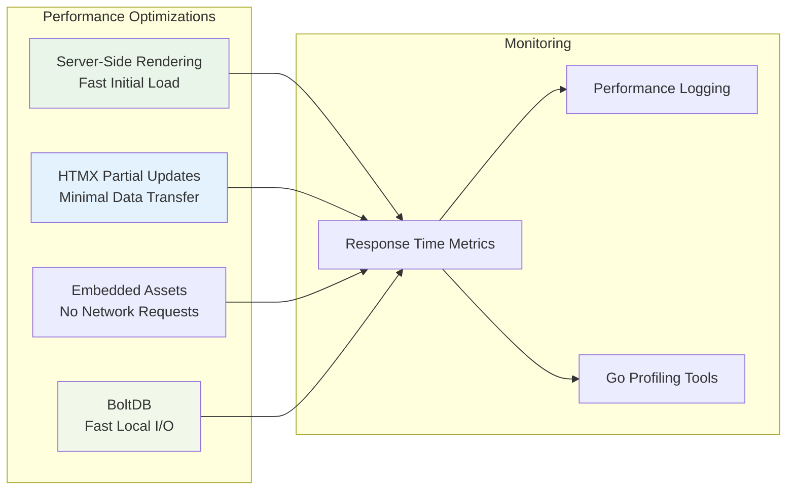

# Quality Attributes & Cross-Cutting Concerns

## Overview

This document outlines the non-functional requirements and quality attributes that shape Camel-Do's architecture. These cross-cutting concerns influence design decisions across all layers of the application and ensure it meets user expectations for performance, reliability, and maintainability.

## Quality Attribute Summary

| Quality Attribute | Priority | Target | Current Status |
|-------------------|----------|--------|----------------|
| **Performance** | High | <100ms page load | ✅ Achieved |
| **Usability** | High | Intuitive drag & drop | ✅ Achieved |
| **Reliability** | Medium | 99.5% uptime | ✅ Achieved |
| **Maintainability** | High | Easy feature addition | ✅ Achieved |
| **Security** | High | OAuth 2.0 + encryption | ✅ Achieved |
| **Portability** | Medium | Cross-platform binary | ✅ Achieved |
| **Scalability** | Low | Single-user focus | ✅ By Design |

## Performance

### Response Time Requirements
- **Page Load Time**: < 100ms for initial render
- **HTMX Updates**: < 50ms for partial page updates  
- **Database Operations**: < 10ms for typical queries
- **Calendar Sync**: < 2s for bi-directional sync

### Performance Architecture



### Performance Strategies

#### Frontend Performance
- **Server-Side Rendering**: Complete HTML generated server-side
- **Minimal JavaScript**: Alpine.js for lightweight interactivity
- **Embedded Assets**: CSS/JS served from memory, no disk I/O
- **Efficient CSS**: Tailwind CSS with tree-shaking
- **Image Optimization**: Optimized icons and images

```go
// Embedded static assets for zero-latency serving
//go:embed all:static
var static embed.FS

// Fast static file serving
e.StaticFS("/static", echo.MustSubFS(static, "static"))
```

#### Backend Performance
- **BoltDB Efficiency**: Single-file database with fast B+ tree access
- **Connection Pooling**: HTTP client reuse for Google API calls
- **Caching Strategy**: In-memory caching of frequently accessed data
- **Efficient Serialization**: GOB encoding for binary efficiency

```go
// Efficient task querying with time-based filtering
func (ts *TaskService) GetTodaysTasks() (*TaskList, error) {
    today := time.Now().Truncate(24 * time.Hour)
    tomorrow := today.Add(24 * time.Hour)
    
    // Only load tasks within time range
    return ts.getTasksInRange(today, tomorrow)
}
```

#### Database Performance
- **Indexed Access**: Key-based access patterns in BoltDB
- **Batch Operations**: Group database writes in transactions
- **Lazy Loading**: Load data only when needed
- **Efficient Queries**: Minimize full-table scans

### Performance Monitoring
```go
// Performance logging middleware
func performanceMiddleware(next echo.HandlerFunc) echo.HandlerFunc {
    return func(c echo.Context) error {
        start := time.Now()
        err := next(c)
        duration := time.Since(start)
        
        slog.Info("REQUEST_PERFORMANCE",
            slog.String("path", c.Request().URL.Path),
            slog.Duration("duration", duration),
            slog.Int("status", c.Response().Status),
        )
        
        return err
    }
}
```

## Reliability

### Availability Requirements
- **Target Uptime**: 99.5% (single-user application)
- **Recovery Time**: < 30 seconds for application restart
- **Data Durability**: 99.99% (local file system dependent)
- **Sync Resilience**: Graceful handling of network failures

### Reliability Strategies

#### Error Handling
- **Graceful Degradation**: Continue operation when Google Calendar unavailable
- **Retry Logic**: Automatic retry for transient failures
- **Circuit Breaker**: Prevent cascading failures with external services
- **Comprehensive Logging**: Detailed error context for troubleshooting

```go
// Robust error handling with fallback
func (ts *TaskSyncService) syncTask(task *model.Task) error {
    retryConfig := &backoff.Config{
        MaxRetries:  3,
        BaseDelay:   time.Second,
        MaxDelay:    time.Minute,
        Multiplier:  2,
    }
    
    return backoff.Retry(func() error {
        return ts.calendarService.CreateEvent(task)
    }, retryConfig)
}
```

#### Data Integrity
- **ACID Transactions**: BoltDB ensures atomic operations
- **Data Validation**: Comprehensive input validation
- **Backup Strategy**: Regular automated backups
- **Corruption Recovery**: Database repair and restoration procedures

#### Fault Tolerance
- **Offline Operation**: Continue without Google Calendar connectivity
- **Service Isolation**: Calendar service failures don't affect local operations
- **Resource Management**: Prevent memory leaks and resource exhaustion
- **Graceful Shutdown**: Clean shutdown with resource cleanup

### Health Monitoring
```go
// Health check endpoint
func healthCheck(c echo.Context) error {
    health := map[string]string{
        "status":     "healthy",
        "database":   checkDatabase(),
        "calendar":   checkCalendarService(),
        "timestamp":  time.Now().UTC().Format(time.RFC3339),
    }
    
    return c.JSON(http.StatusOK, health)
}
```

## Usability

### User Experience Requirements
- **Learning Curve**: < 5 minutes to basic proficiency
- **Task Management**: Intuitive drag & drop interface
- **Response Feedback**: Immediate visual feedback for all actions
- **Error Recovery**: Clear error messages with recovery guidance

### Usability Features

#### Interface Design
- **Drag & Drop**: Intuitive task reordering and scheduling
- **Real-time Updates**: HTMX for seamless interactions
- **Responsive Design**: Works across different screen sizes
- **Keyboard Navigation**: Full keyboard accessibility

#### User Feedback
- **Loading States**: Visual indicators for async operations
- **Success Messages**: Confirmation of completed actions
- **Error Messages**: Clear, actionable error descriptions
- **Progress Indicators**: Sync status and progress display

```html
<!-- HTMX with loading indicators -->
<form hx-post="/tasks" hx-indicator="#loading">
    <div id="loading" class="htmx-indicator">
        <div class="spinner">Saving...</div>
    </div>
    <!-- form fields -->
</form>
```

#### Accessibility
- **Semantic HTML**: Proper HTML structure for screen readers
- **ARIA Labels**: Comprehensive ARIA attribute usage
- **Color Contrast**: WCAG AA compliant color schemes
- **Keyboard Navigation**: Full functionality without mouse

## Maintainability

### Code Quality Requirements
- **Code Coverage**: > 80% test coverage
- **Cyclomatic Complexity**: < 10 per function
- **Documentation**: All public APIs documented
- **Type Safety**: Leverage Go's type system fully

### Maintainability Strategies

#### Architecture Patterns
- **Service-Oriented**: Clear separation of concerns
- **Dependency Injection**: Testable and modular components
- **Interface Segregation**: Small, focused interfaces
- **Single Responsibility**: Each component has one clear purpose

```go
// Clean interface design
type TaskService interface {
    AddTask(task *model.Task) error
    GetTask(id string) (*model.Task, error)
    UpdateTask(task *model.Task) error
    DeleteTask(id string) error
}
```

#### Code Organization
- **Package Structure**: Logical grouping by domain
- **Consistent Naming**: Clear, descriptive names
- **Error Handling**: Consistent error handling patterns
- **Configuration**: Environment-based configuration

#### Testing Strategy
- **Unit Tests**: Comprehensive service layer testing
- **Integration Tests**: End-to-end workflow testing
- **Test Utilities**: Shared test helpers and fixtures
- **Continuous Testing**: Automated test execution

```go
// Example test structure
func TestTaskService_AddTask(t *testing.T) {
    tests := []struct {
        name    string
        task    *model.Task
        wantErr bool
    }{
        {
            name: "valid task",
            task: &model.Task{Title: zero.StringFrom("Test")},
            wantErr: false,
        },
        // additional test cases
    }
    
    for _, tt := range tests {
        t.Run(tt.name, func(t *testing.T) {
            // test implementation
        })
    }
}
```

## Security (Cross-Cutting)

### Security Requirements
- **Authentication**: OAuth 2.0 with Google
- **Data Protection**: Encryption at rest for sensitive data
- **Input Validation**: Comprehensive input sanitization
- **Audit Trail**: Security event logging

### Security Implementation
- **HTTPS Enforcement**: All external communication encrypted
- **Token Management**: Secure OAuth token storage and refresh
- **XSS Prevention**: Template-based HTML escaping
- **CSRF Protection**: State parameter validation

## Observability

### Logging Strategy
```go
// Structured logging configuration
logger := slog.New(slog.NewTextHandler(os.Stdout, &slog.HandlerOptions{
    Level: slog.LevelDebug,
}))

// Contextual logging
slog.LogAttrs(context.Background(), slog.LevelInfo, "TASK_CREATED",
    slog.String("task_id", task.ID),
    slog.String("project_id", task.ProjectID.String),
    slog.Duration("duration", time.Duration(task.Duration.Int32)*time.Minute),
)
```

### Monitoring Capabilities
- **Application Metrics**: Response times, error rates, resource usage
- **Business Metrics**: Task creation rates, sync frequency, user engagement
- **System Metrics**: Database size, memory usage, CPU utilization
- **External Service Metrics**: Google API usage, error rates, latency

### Alerting
- **Error Thresholds**: Alert on elevated error rates
- **Performance Degradation**: Monitor response time increases
- **Service Availability**: Alert on external service failures
- **Resource Limits**: Monitor disk space and memory usage

## Scalability Considerations

### Single-User Design
- **By Design Limitation**: Application optimized for single-user operation
- **Local Storage**: BoltDB eliminates network latency
- **Resource Efficiency**: Minimal resource requirements
- **Deployment Simplicity**: Single binary deployment

### Future Scalability Options
- **Database Migration**: Path to multi-user database (PostgreSQL)
- **Service Separation**: Microservice decomposition potential
- **Caching Layer**: Redis integration for multi-user scenarios
- **Load Balancing**: Horizontal scaling capabilities

## Performance Testing

### Load Testing Strategy
```bash
# Example load testing with Apache Bench
ab -n 1000 -c 10 http://localhost:4000/

# Memory profiling
go test -memprofile=mem.prof -bench=.
go tool pprof mem.prof

# CPU profiling  
go test -cpuprofile=cpu.prof -bench=.
go tool pprof cpu.prof
```

### Performance Benchmarks
```go
// Benchmark example
func BenchmarkTaskService_GetTodaysTasks(b *testing.B) {
    ts := setupTestTaskService()
    
    b.ResetTimer()
    for i := 0; i < b.N; i++ {
        _, err := ts.GetTodaysTasks()
        if err != nil {
            b.Fatal(err)
        }
    }
}
```

## Quality Gates

### Definition of Done
- [ ] All tests pass (unit, integration)
- [ ] Code coverage > 80%
- [ ] Performance benchmarks met
- [ ] Security review completed
- [ ] Documentation updated
- [ ] Error handling implemented
- [ ] Logging instrumentation added

### Continuous Quality
- **Automated Testing**: CI/CD pipeline with quality gates
- **Code Reviews**: Peer review for all changes
- **Static Analysis**: golangci-lint integration
- **Dependency Updates**: Regular security updates
- **Performance Monitoring**: Continuous performance tracking